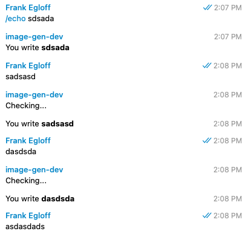

# Grammy Conversation test
Bot that uses Grammy conversation plugin to echo user input. The waitFor method uses the maxMilliseconds parameter to wait for user input. The expected behavior is that once the user writes, the maxMilliseconds should restart and wait for the next user input. The current behavior is the conversation ends once reaches the maxMilliseconds value, despite user input.

Can we have an event that handles when a conversation abruptly ends?

